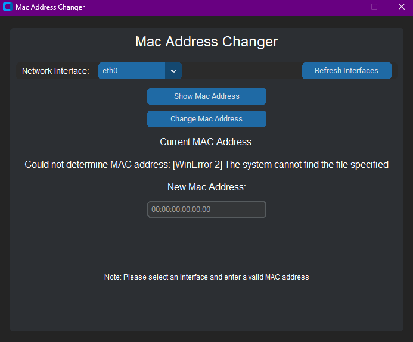

# 🛠️ MAC Address Changer GUI

A simple yet powerful GUI-based MAC address changer built using Python and `customtkinter`. Easily view and change the MAC address of your network interfaces with just a few clicks!

## 🚀 Features

- 🖥 GUI built using `customtkinter` (modern `tkinter` alternative)
- 🔍 View current MAC address of selected network interface
- ✍️ Change MAC address manually
- ♻️ Refresh available network interfaces
- 🛑 Error handling and status messages
- 🔒 Designed for Linux-based systems

## 📸 Preview

![screenshot or gif placeholder if applicable]

## 🧰 Requirements

- Python 3.6+
- `customtkinter`
- Root privileges (for changing MAC addresses)
- Linux system (`ifconfig` is required)

## 📦 Installation

1. **Clone the repository**

   ```bash
   git clone https://github.com/yourusername/mac-address-changer.git
   cd mac-address-changer
   ```
2. **Install dependencies**

   ```bash
   pip install customtkinter
   ```
3. **Run the application**

   ```bash
   sudo python3 Mac_Address_Changer.py
   ```

## ⚙️ Usage

1. Launch the app as root (`sudo` is needed to change MAC addresses).
2. Select your desired network interface from the dropdown.
3. Click "Show MAC Address" to view the current one.
4. Enter a new valid MAC address (format: `XX:XX:XX:XX:XX:XX`).
5. Click "Change MAC Address".
6. Status and errors will be shown on-screen.

## 🔐 Note

* This tool is for **educational** and **authorized** use only.
* Always make sure you have permission before changing MAC addresses on any device/network.

## ❗ Troubleshooting

* **Interface not listed?** Click "Refresh Interfaces".
* **MAC not changing?** Make sure:
  * You are running as `sudo`
  * The new MAC is valid
  * `ifconfig` is available on your system

## 🧠 Code Structure

* `MacChanger` class handles core operations:
  * Listing interfaces
  * Getting current MAC
  * Changing/resetting MAC
* `GUI` class builds the interactive interface

## ✍️ Author

Vedant Sareen

## 📜 License

This project is licensed under the MIT License - see the [LICENSE]() file for details.

# 🛠️ MAC Address Changer GUI

A simple yet powerful GUI-based MAC address changer built using Python and `customtkinter`. Easily view and change the MAC address of your network interfaces with just a few clicks!

## 🚀 Features

- 🖥 GUI built using `customtkinter` (modern `tkinter` alternative)
- 🔍 View current MAC address of selected network interface
- ✍️ Change MAC address manually
- ♻️ Refresh available network interfaces
- 🛑 Error handling and status messages
- 🔒 Designed for Linux-based systems

## 📸 Preview



## 🧰 Requirements

- Python 3.6+
- `customtkinter`
- Root privileges (for changing MAC addresses)
- Linux system (`ifconfig` is required)

## 📦 Installation

1. **Clone the repository**
   ```bash
   git clone https://github.com/yourusername/mac-address-changer.git
   cd mac-address-changer
   ```
